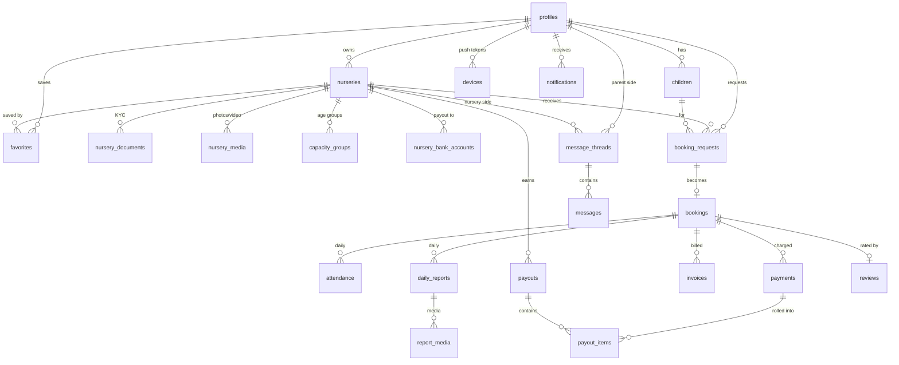
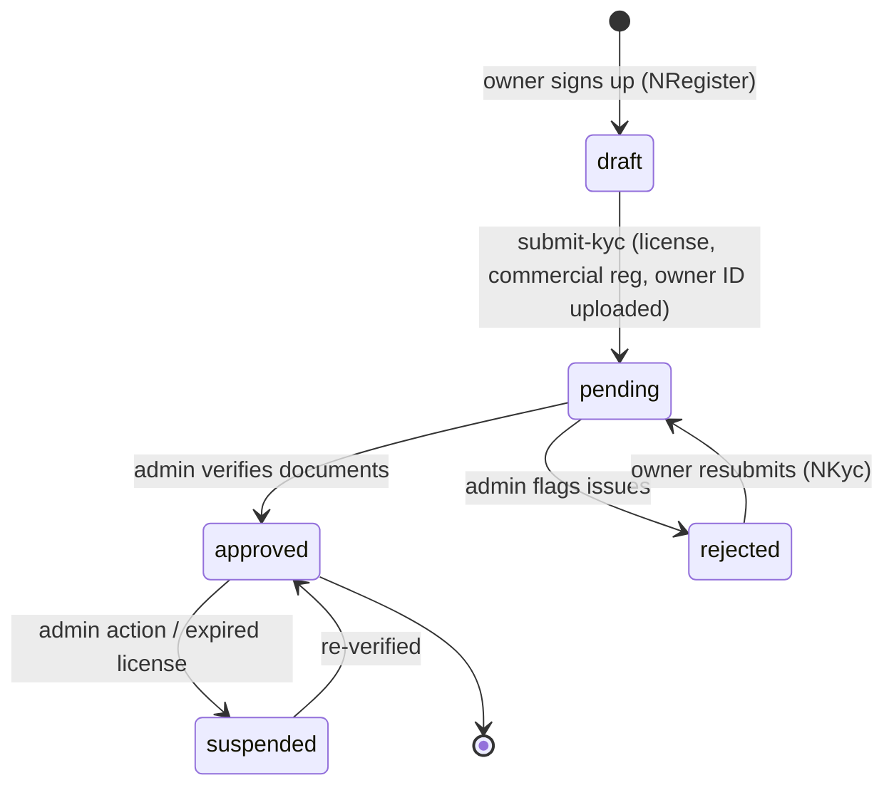
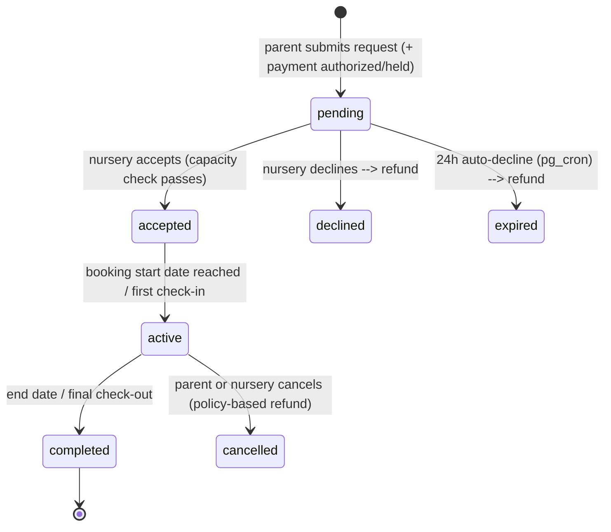
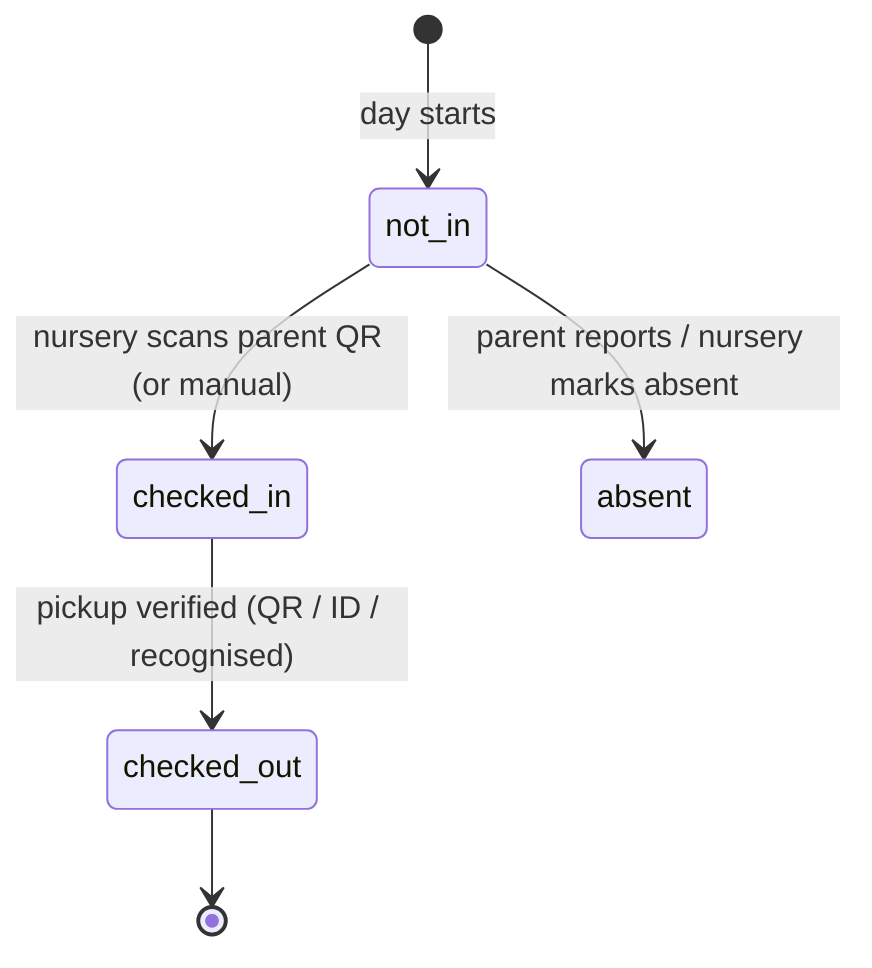

# Hadanati Platform — System Architecture & Lifecycle

> A complete, production-oriented design for the Hadanati nursery-booking marketplace:
> the two mobile apps, the backend, the database, the admin system, payments, and the
> end-to-end project lifecycle. Sized for an **early-stage launch (hundreds → a few
> thousand active users)** on **Supabase**, with a clear path to scale up later
> **without rewrites**.

| | |
|---|---|
| **Domain** | Two-sided nursery-booking marketplace (Amman, Jordan) |
| **Backend** | Supabase (PostgreSQL + Auth + Storage + Realtime + Edge Functions) |
| **Mobile** | React Native / Expo SDK 56 (two apps: parents + nursery providers) |
| **Admin** | React + Vite web dashboard |
| **Target scale (v1)** | ~1,000–5,000 users, single region (EU/Frankfurt), low cost |
| **Currency / locale** | JOD, Arabic + English, RTL-aware |

---

## Table of contents

1. [Goals & non-goals](#1-goals--non-goals)
2. [System components](#2-system-components)
3. [High-level architecture](#3-high-level-architecture)
4. [Technology stack & rationale](#4-technology-stack--rationale)
5. [Data model](#5-data-model)
6. [Authentication & authorization](#6-authentication--authorization)
7. [Core domain lifecycles](#7-core-domain-lifecycles)
8. [Realtime](#8-realtime)
9. [Storage & media](#9-storage--media)
10. [Push notifications](#10-push-notifications)
11. [Edge Functions & scheduled jobs](#11-edge-functions--scheduled-jobs)
12. [Admin system](#12-admin-system)
13. [Security & privacy](#13-security--privacy)
14. [Scalability & performance](#14-scalability--performance)
15. [Environments, CI/CD & release](#15-environments-cicd--release)
16. [Observability](#16-observability)
17. [Project lifecycle (SDLC) & delivery roadmap](#17-project-lifecycle-sdlc--delivery-roadmap)
18. [Cost estimate](#18-cost-estimate)
19. [Migration from the current mock build](#19-migration-from-the-current-mock-build)

---

## 1. Goals & non-goals

### Goals
- **One backend, two apps.** A single source of truth serving both the parent app (`HadanatiApp`) and the nursery-provider app (`NurseryApp`), plus the admin dashboard.
- **Handle a healthy concurrent load** at launch (the user's core requirement: *يتحمل الموبايل ابليكيشن عدد يوزرز جيد*) — comfortably serve thousands of users with predictable latency, and scale up by changing tiers/config, not architecture.
- **Trust & safety first.** Children's data is the most sensitive asset in the system; every access path is locked down by Row-Level Security (RLS).
- **Marketplace integrity.** Money flows (parent → escrow → nursery payout) and KYC approval must be auditable and never bypassable from a client.
- **Offline-tolerant mobile UX.** Apps keep their local cache (the AsyncStorage they already use) as a read cache, synced against the server.

### Non-goals (v1)
- Multi-region / multi-cloud deployment (single region is correct at this scale).
- Microservices. A modular monolith on Supabase is faster and cheaper; we split only if a true bottleneck appears.
- In-house payment processing — we integrate a licensed Jordanian/MENA gateway, never store raw card data (PCI scope stays with the gateway).

---

## 2. System components

```
┌──────────────────────┐   ┌──────────────────────┐   ┌──────────────────────┐
│  HadanatiApp (Parent) │   │ NurseryApp (Provider) │   │  Admin Web Dashboard  │
│  Expo / React Native  │   │  Expo / React Native  │   │   React + Vite (web)  │
│  Phone-OTP login      │   │  Email/password login │   │  Email + MFA login    │
└──────────┬───────────┘   └──────────┬───────────┘   └──────────┬───────────┘
           │                          │                          │
           │  HTTPS (supabase-js: PostgREST + Realtime + Storage + Auth)
           └──────────────┬───────────┴──────────────┬───────────┘
                          ▼                           ▼
                ┌───────────────────────────────────────────────┐
                │                  SUPABASE                       │
                │  ┌─────────────┐  ┌──────────┐  ┌────────────┐  │
                │  │  Postgres   │  │   Auth    │  │  Storage   │  │
                │  │  + RLS      │  │ (GoTrue)  │  │ (S3-backed)│  │
                │  └─────┬───────┘  └──────────┘  └────────────┘  │
                │  ┌─────┴───────┐  ┌──────────┐  ┌────────────┐  │
                │  │  Realtime   │  │ Edge Fns  │  │  pg_cron   │  │
                │  │ (WS changes)│  │  (Deno)   │  │ (schedule) │  │
                │  └─────────────┘  └────┬─────┘  └────────────┘  │
                └───────────────────────┼────────────────────────┘
                                        │ (server-to-server, service role)
                 ┌──────────────────────┼─────────────────────────┐
                 ▼                      ▼                          ▼
        ┌────────────────┐    ┌──────────────────┐      ┌──────────────────┐
        │ Payment gateway │    │  Expo Push / FCM  │      │  SMS provider     │
        │ (cards + CLIQ)  │    │   + APNs          │      │  (OTP delivery)   │
        └────────────────┘    └──────────────────┘      └──────────────────┘
```

| Component | Responsibility |
|---|---|
| **HadanatiApp** | Discover & book nurseries, manage children, pay, view daily reports, QR pickup/drop-off, chat, notifications. |
| **NurseryApp** | Onboard + KYC, manage capacity & pricing, accept/decline requests, run attendance, compose daily reports, view billing & payouts, chat. |
| **Admin dashboard** | Approve/reject nurseries (KYC review), manage users & listings, oversee bookings & disputes, reconcile payments & trigger payouts, support, analytics, content moderation. |
| **Postgres + RLS** | Single source of truth; every table protected by row-level policies keyed to the authenticated user's role and ownership. |
| **Auth (GoTrue)** | Phone-OTP for parents, email/password for nurseries, email + MFA for admins; JWT carries `role` claim used by RLS. |
| **Storage** | Private buckets for KYC docs, child photos, daily-report media, nursery media, avatars — each with RLS. |
| **Realtime** | Live attendance board, chat, and incoming booking requests over WebSockets. |
| **Edge Functions (Deno)** | Trusted server logic: payment webhooks, payout computation, push fan-out, OTP hooks, request expiry — anything that must not be trusted to a client. |
| **pg_cron** | Scheduled jobs: auto-decline expired requests, monthly payout runs, license-expiry reminders, nightly rollups. |

---

## 3. High-level architecture

**Pattern: a modular monolith on managed infrastructure.** The client SDK (`supabase-js`) talks directly to PostgREST for ordinary CRUD — but **only through RLS**, so the database itself is the authorization boundary. Anything privileged or multi-step (money, KYC state transitions, push fan-out) goes through an **Edge Function** running with the service role, never the client.

**Two trust tiers:**
- **Tier 1 — client direct (RLS-guarded):** reads/writes a user is allowed to do on their own rows (a parent editing their child, a nursery updating its capacity). Fast, no extra hop.
- **Tier 2 — Edge Function (service role):** operations that cross ownership boundaries or must be tamper-proof: `submit-kyc`, `confirm-booking`, `payment-webhook`, `run-payouts`, `send-push`. RLS is bypassed here *by design*, so all validation lives in the function.

This keeps the common path cheap and the dangerous path locked down.

---

## 4. Technology stack & rationale

| Layer | Choice | Why |
|---|---|---|
| Mobile | **Expo SDK 56 / RN 0.85** (already in use) | Existing codebase; OTA updates; EAS builds. |
| State/data on device | **TanStack Query + supabase-js**, AsyncStorage as cache | Caching, retries, optimistic updates, offline read; replaces the current hand-rolled context store gradually. |
| Backend | **Supabase** | Postgres + Auth + Storage + Realtime + Functions in one managed product. Removes ~80% of the DevOps an early team can't afford, yet it's *just Postgres* underneath — no lock-in at the data layer. |
| Database | **PostgreSQL 15+** | Relational marketplace data (bookings, invoices, payouts) needs joins, constraints, transactions. RLS is first-class. |
| Authorization | **Postgres RLS** | The DB is the security boundary; a client bug can't leak another family's child data. |
| Server logic | **Edge Functions (Deno/TypeScript)** | Same language as the apps; runs close to the DB; service-role for trusted ops. |
| Scheduling | **pg_cron** (+ `pg_net` for outbound calls) | Native, no extra worker infra at this scale. |
| Admin web | **React + Vite + TypeScript**, same `supabase-js` | Shares types and the same auth; ships as a static site (Vercel/Netlify/Supabase hosting). |
| Push | **Expo Push** → FCM/APNs | One API for both apps; works with the existing Expo setup. |
| Payments | **Licensed MENA gateway** (cards) + **CLIQ/JoMoPay** (bank instant transfer) | Jordan-appropriate rails; gateway holds PCI scope. |
| SMS/OTP | **Regional SMS provider** wired into Supabase Auth phone provider | Reliable Jordan delivery for OTP. |
| Error tracking | **Sentry** (mobile + functions + admin) | One place for crashes and function errors. |
| Analytics | **PostHog** (or Supabase + SQL) | Product funnels without shipping PII to third parties. |

---

## 5. Data model

The full, runnable schema lives in [`docs/database/schema.sql`](database/schema.sql) (Postgres DDL + enums + RLS policies + indexes + triggers). Summary of the core entities and how they relate:



**Entity groups**

- **Identity:** `profiles` (1:1 with `auth.users`, carries `role`), `children`, `devices`.
- **Supply:** `nurseries`, `nursery_documents` (KYC), `nursery_media`, `capacity_groups`, `nursery_bank_accounts`.
- **Demand & marketplace:** `favorites`, `booking_requests`, `bookings`, `reviews`.
- **Operations:** `attendance`, `daily_reports`, `report_media`.
- **Money:** `payments`, `invoices`, `payouts`, `payout_items`.
- **Communication:** `message_threads`, `messages`, `notifications`.
- **Governance:** `audit_log` (every admin/state-changing action).

The existing app types map cleanly: the parent app's `Child`, `Booking`, `Thread`, `Notification` and the nursery app's `BookingRequest`, `RosterChild` (→ `attendance`), `DailyReport`, `Invoice`, `Payout`, `registration` (→ `nurseries` + `nursery_documents`) all have a home. The mobile apps shrink to thin clients over these tables.

---

## 6. Authentication & authorization

### Identity per role
| Role | Sign-in | Notes |
|---|---|---|
| **Parent** | Phone OTP (SMS) | Matches current `Login` UX (`+962 7XXXXXXXX`). No password to lose. |
| **Nursery owner** | Email + password | Matches `NLogin`; phone captured for contact. Optional OTP step-up. |
| **Admin** | Email + password **+ mandatory MFA (TOTP)** | Smallest, highest-privilege group. |

On first authentication a `profiles` row is created via a trigger on `auth.users`, with `role` set from sign-up context. The role is also copied into the JWT (`app_metadata.role`) so RLS policies can read it cheaply with `auth.jwt()`.

### Authorization model (RLS, enforced in the DB)
Representative policies (full set in `schema.sql`):
- A parent can `select/insert/update/delete` a `children` row **only** where `parent_id = auth.uid()`.
- A nursery owner can read `booking_requests` **only** for nurseries they own; they may transition status (`accept`/`decline`) but cannot edit price or child data.
- `attendance` and `daily_reports` are writable by the **owning nursery**, readable by **that nursery and the booking's parent**.
- `payments`/`payouts` are **read-only** to the relevant party; only Edge Functions (service role) and admins write them.
- Admins (`role = 'admin'`) get broad read + governed write, with every write mirrored into `audit_log`.

> **Principle:** the client is never trusted. Even if someone forges a request with another user's IDs, RLS rejects it at the row level.

---

## 7. Core domain lifecycles

These state machines are the heart of the system. Each transition is owned by a specific actor and (where money or trust is involved) executed inside an Edge Function so it can't be skipped or forged.

### 7.1 Nursery onboarding & KYC



- **Owner** fills `nurseries` (draft) + uploads docs to the private `kyc` bucket → calls `submit-kyc` → status `pending`.
- **Admin** reviews in the dashboard; `approve`/`reject` writes `nurseries.status`, stamps `reviewed_by/at`, and writes `audit_log`.
- Only **approved + listed** nurseries appear in parent search (enforced by an RLS policy on the public `nurseries` view).
- `pg_cron` raises a license-expiry reminder 38 days out (the NurseryApp already references this) and auto-suspends on expiry.

### 7.2 Booking



- **Capacity is authoritative on the server:** `confirm-booking` (Edge Function) re-checks `capacity_groups.filled < total` inside a transaction before accepting — the client's view can be stale, the DB cannot.
- Payment is **authorized/held** at request time and **captured** on acceptance; decline/expiry triggers a refund (see §7.4). This protects both sides.
- `pg_cron` runs every few minutes to expire requests past `expires_at`.

### 7.3 Attendance (QR check-in / check-out)



- Parent app shows a **signed, short-lived QR** (a JWT-like token bound to `booking_id` + day, expiring in minutes) for pickup/drop-off — not a static code, so it can't be screenshotted and reused.
- Nursery scans → Edge Function verifies the token → writes `attendance`. The roster board updates live via Realtime.
- Check-out flow records the verification method (`scanned_qr` / `checked_id` / `recognised`) — matching the existing `NCheckoutReport` UX — for safety auditing.

### 7.4 Payments & settlement (escrow model)

```mermaid
sequenceDiagram
    participant P as Parent app
    participant G as Payment gateway
    participant EF as Edge Function
    participant DB as Postgres
    participant N as Nursery

    P->>G: Pay (card / CLIQ) for booking request
    G-->>P: Authorization (funds held)
    G->>EF: Webhook: payment authorized
    EF->>DB: payments.status = authorized (held in escrow)
    Note over N: Nursery accepts request
    EF->>G: Capture
    G->>EF: Webhook: captured
    EF->>DB: payments.status = captured, compute service_fee (5%) + net_amount
    Note over DB: pg_cron monthly payout run
    EF->>DB: aggregate captured payments → payouts (gross/fees/net)
    EF->>N: Bank/CLIQ transfer of net; payouts.status = paid
```

- **Escrow protects everyone:** parent's money is held until the nursery accepts; if declined/expired/cancelled, it's refunded automatically.
- **Service fee 5%** per booking (already shown in the app) is computed server-side into `payments.net_amount`; never trust a client total.
- **Monthly payouts:** `run-payouts` aggregates the month's captured payments per nursery into a `payouts` row (gross/fees/net) and disburses to the stored bank account / CLIQ alias. `payout_items` links each payment to its payout for full reconciliation.
- **Idempotency:** every gateway webhook carries an event id; `payment-webhook` upserts on it so retries can't double-charge or double-pay.

### 7.5 Daily reports

`draft → sent`. Nursery composes (mood, meals, nap, diapers, activities, note, photos) → on **send**, the report is locked, media is finalized in the `reports` bucket, the parent gets a push + in-app notification, and the report becomes read-only to the parent.

### 7.6 Messaging & notifications

- **Threads** are 1:1 parent↔nursery, created lazily on first message or booking. In-app only (the app already states "in-app messaging only — for safety").
- **Messages** stream over Realtime; unread counts drive the tab badges already present in both apps.
- **Notifications** are rows in `notifications` (drives the in-app list) **and** a push via `send-push`. Kinds map to the existing UX: `booking`, `payment`, `review`, `system`, `report`, `attendance`.

---

## 8. Realtime

Supabase Realtime (Postgres logical replication over WebSockets) powers three live surfaces:

| Surface | Channel | Subscribed by |
|---|---|---|
| Attendance roster | `attendance:nursery_id=eq.<id>` | NurseryApp dashboard/attendance |
| Chat | `messages:thread_id=eq.<id>` | Both apps, open thread |
| Incoming requests | `booking_requests:nursery_id=eq.<id>` | NurseryApp (badge + list) |

Realtime respects RLS, so a socket only delivers rows the user may see. Everything else uses ordinary polling/refetch via TanStack Query — no need to keep a socket open for low-churn data.

---

## 9. Storage & media

Private buckets, each with RLS keyed to ownership; clients get **signed URLs** with short TTLs (no public file URLs for anything involving children or documents).

| Bucket | Contents | Read access |
|---|---|---|
| `kyc` | License, commercial reg, owner ID, insurance | Owning nursery + admins only |
| `children` | Child profile photos | Parent + the nursery currently booking that child |
| `reports` | Daily-report photos/video | Report's parent + owning nursery |
| `nursery-media` | Public listing photos/cover/intro video | Public read (these are marketing assets) |
| `avatars` | Profile photos | Public read (low sensitivity) |

Uploads go direct to Storage via signed upload URLs (keeps large files off the function path). Image variants/thumbnails generated on demand via the image transform endpoint.

---

## 10. Push notifications

- Each device registers its **Expo push token** in `devices` on login.
- `send-push` (Edge Function) is the single fan-out point: it's called by other functions/triggers (new request, report sent, payment, message) and batches tokens to the Expo Push API → FCM/APNs.
- Notification rows are written first (durable, drives the in-app list); push is best-effort on top.

---

## 11. Edge Functions & scheduled jobs

**Functions (service role, the Tier-2 trusted path):**

| Function | Trigger | Job |
|---|---|---|
| `submit-kyc` | Nursery app | Validate uploaded docs, move nursery → `pending`. |
| `confirm-booking` | Parent app | Transactional capacity check + create booking + authorize payment. |
| `respond-request` | Nursery app | Accept (capture payment) / decline (refund). |
| `verify-qr` | Nursery app | Validate pickup/drop-off token, write attendance. |
| `payment-webhook` | Gateway | Idempotent payment state updates. |
| `run-payouts` | pg_cron (monthly) | Aggregate captured payments → payouts → disburse. |
| `send-push` | Internal | Fan-out push notifications. |
| `admin-action` | Admin web | Approve/reject/suspend with audit logging. |

**Scheduled (pg_cron):**

| Schedule | Job |
|---|---|
| every 5 min | Expire `booking_requests` past `expires_at` (+ refund). |
| daily 02:00 | Nightly rollups (today's revenue, checked-in counts) for fast dashboards. |
| daily 06:00 | License-expiry reminders (T-38d), auto-suspend expired. |
| monthly 1st | `run-payouts`. |

---

## 12. Admin system

A separate **React + Vite** web app, same Supabase project, `role = 'admin'` + MFA.

**Modules**
- **Verification queue** — KYC review: view documents (signed URLs), approve/reject/request-changes, with reasons. The single most important admin workflow.
- **Nurseries** — list/search, listing status, suspend/reactivate, edit verified-only fields (district).
- **Users** — parents & owners, support lookups, account status, data-export/delete requests (privacy compliance).
- **Bookings & disputes** — full booking timeline, manual refunds/cancellations, dispute resolution.
- **Finance** — payment reconciliation, payout runs (preview + trigger), service-fee reporting.
- **Content moderation** — reported reviews/photos/messages.
- **Analytics** — supply/demand funnels, occupancy, GMV, take-rate, cohort retention.
- **Audit log** — immutable record of every admin action.

The admin app uses **only Tier-2 Edge Functions** for writes (`admin-action`) so every privileged change is validated server-side and audited — the dashboard never writes sensitive tables directly.

---

## 13. Security & privacy

Children's data raises the bar well above a typical app.

- **RLS everywhere, deny-by-default.** No table is readable without an explicit policy. This is the primary control.
- **Least privilege.** Clients never hold the service-role key; it lives only in Edge Functions' environment.
- **Sensitive files are never public.** KYC, child photos, and reports use signed, short-TTL URLs and ownership-scoped bucket policies.
- **Short-lived QR tokens** for pickup/drop-off — bound to booking + day, expiring in minutes; prevents replay.
- **PII minimization.** Phone numbers are shown to a nursery only after a booking exists (the app already does this); analytics receive no direct PII.
- **Jordan Personal Data Protection Law (No. 24 of 2023) alignment:** explicit consent at sign-up, purpose limitation, data-subject access/erasure flows (handled in the admin Users module), and a documented retention policy (e.g., KYC retained per regulation, child records deletable on account closure).
- **Transport & at rest:** TLS in transit; Supabase encrypts at rest. Daily automated backups + point-in-time recovery (enable on the Pro tier).
- **Auditability.** All money movements and admin actions are append-only in `audit_log` / `payments` / `payouts`.
- **Rate limiting & abuse:** OTP attempts throttled (Auth), Edge Functions guard against enumeration, gateway webhooks verified by signature.
- **Secrets** in Supabase Function secrets / EAS secrets — never in the repo.

---

## 14. Scalability & performance

This is the user's central requirement — *the app should comfortably carry a good number of users.* How the design delivers that at launch, and how it scales after:

### Why it holds at launch (1k–5k users)
- **Postgres on a small Supabase instance** handles thousands of concurrent users for this workload (mostly small indexed reads/writes). The bottleneck at this size is almost never CPU — it's **connections** and **missing indexes**, both addressed below.
- **Connection pooling (PgBouncer / Supavisor)** is on by default. Mobile clients use the pooled endpoint, so thousands of app sessions map onto a small pool of DB connections — this is what lets a modest instance serve many users.
- **Indexes on every hot path** (foreign keys + status/date filters) ship in `schema.sql`: `booking_requests(nursery_id, status)`, `attendance(nursery_id, date)`, `messages(thread_id, created_at)`, `nurseries(district, status)`, etc. Searches and dashboards stay sub-50 ms.
- **Read the cheap path directly, compute the expensive path nightly.** Dashboard aggregates (today's revenue, checked-in counts, occupancy) are precomputed by a nightly cron into a small `nursery_daily_stats` table, so opening the dashboard is a single indexed row read, not a scan.
- **TanStack Query on the client** caches and de-dupes requests; combined with the existing AsyncStorage cache, a returning user paints instantly and refetches in the background.
- **Realtime is scoped by RLS filters**, so sockets only carry rows a user can see — no broadcast storms.

### Capacity headroom & when to scale
| Signal | Action (no rewrite) |
|---|---|
| DB CPU > ~70% sustained | Bump Supabase compute tier (vertical scale, minutes of downtime or none). |
| Connection saturation | Already pooled; raise pool size / move heavy reads to a **read replica**. |
| Search latency rising | Add covering indexes; introduce **full-text search** (`pg_trgm`) for nursery name/district. |
| Function cold-starts under load | Increase function concurrency; cache hot lookups in Postgres. |
| Media bandwidth growth | Front Storage with a **CDN** (Supabase CDN / Cloudflare) — already signed-URL based, so it's a config change. |
| Push/job volume growth | Move fan-out to a queue (`pgmq`) with worker functions. |

The key property: **every scaling lever here is a tier change or a config/index addition — never a re-architecture.** That is what "sized for early stage, scales without rewrites" means concretely.

### Load targets (v1 acceptance)
- p95 API read latency < 200 ms; p95 write < 400 ms.
- Dashboard first paint < 1 s on a returning user.
- Sustained 200 req/s with < 1% error rate on a small instance (validate with a k6 load test before launch).

---

## 15. Environments, CI/CD & release

**Three environments**, each a separate Supabase project:

| Env | Purpose | Data |
|---|---|---|
| `dev` | Local + shared dev | Seed/fake data |
| `staging` | Pre-release QA, matches prod config | Anonymized copy |
| `prod` | Live | Real |

**Database changes** are **migrations in git** (`supabase/migrations/*.sql`), applied via the Supabase CLI in CI — never hand-edited in the dashboard. `schema.sql` here is the initial migration.

**CI/CD (GitHub Actions):**
- On PR: typecheck, lint, unit tests (both apps + functions), `supabase db diff` check.
- On merge to `main`: deploy Edge Functions + apply migrations to **staging**; run integration + k6 smoke.
- On release tag: promote to **prod**; build apps with **EAS** (`eas build`), submit via `eas submit`; ship JS-only fixes as **EAS Update** (OTA) without store review.

**Mobile release:** versioned EAS build profiles (`development`, `preview`, `production`); staged rollout on the stores; feature flags for risky changes.

---

## 16. Observability

- **Errors:** Sentry in both apps, all Edge Functions, and the admin app — release-tagged, with source maps.
- **Logs/metrics:** Supabase logs + dashboards for DB, Auth, Functions, Realtime; alerts on error rate, DB CPU, connection count, slow queries.
- **Product analytics:** PostHog funnels (search → request → booking → completion; nursery onboarding → approval). No PII to third parties.
- **Uptime:** external healthcheck (e.g., Better Stack) hitting a `health` Edge Function.
- **Money reconciliation dashboard:** daily automated check that captured payments == invoices == payout_items, alerting on any drift.

---

## 17. Project lifecycle (SDLC) & delivery roadmap

End-to-end lifecycle from idea to operation, then the phased build plan.

### Lifecycle (continuous loop)
```
Discovery → Design → Build → Test → Release → Operate → Measure → (back to Discovery)
```
- **Discovery:** validate requirements with real nurseries/parents; refine the data model.
- **Design:** schema + RLS + API contracts (this document); UX already exists in the apps.
- **Build:** vertical slices (one full lifecycle at a time), behind feature flags.
- **Test:** unit (logic), integration (RLS + functions against a real ephemeral DB), E2E (Detox on devices), load (k6). **A test that doesn't exercise RLS hasn't tested authorization.**
- **Release:** CI/CD as above; staged rollout.
- **Operate:** monitor, run scheduled jobs, support via admin.
- **Measure:** analytics + reconciliation feed the next cycle.

### Phased roadmap

| Phase | Scope | Outcome |
|---|---|---|
| **0 — Foundations (1–2 wk)** | Supabase projects (dev/staging/prod), `schema.sql` migration, Auth (phone OTP + email), RLS, CI/CD, Sentry. | Backend skeleton live; apps can authenticate. |
| **1 — Identity & supply (2–3 wk)** | Profiles, children, nursery onboarding + KYC upload, admin verification queue. | Real nurseries can be approved and listed. |
| **2 — Discovery & booking (3–4 wk)** | Nursery search/listing, favorites, booking requests, capacity, accept/decline, escrow auth/capture. | A parent can book and pay; a nursery can accept. |
| **3 — Operations (3–4 wk)** | QR attendance, daily reports + media, realtime roster, messaging, push. | Day-to-day nursery operations run on the platform. |
| **4 — Money (2–3 wk)** | Invoices, monthly payouts, reconciliation, finance admin. | Nurseries get paid; books balance. |
| **5 — Harden & launch (2 wk)** | Load test, security review, privacy flows (export/delete), backups/PITR, observability polish. | Production launch. |
| **6 — Iterate** | Reviews, analytics-driven improvements, seasonal pricing, scale levers as signals appear. | Growth. |

Each phase ends with the relevant **lifecycle (§7) fully working end-to-end** — not horizontal layers. That's what lets you ship and learn early.

---

## 18. Cost estimate (early-stage, monthly)

| Item | Tier | Est. (USD/mo) |
|---|---|---|
| Supabase | **Pro** (8 GB DB, daily backups + PITR, better limits) | ~$25 + usage |
| Expo / EAS | Production plan (builds + OTA) | ~$0–99 |
| Sentry | Team | ~$0–26 |
| Analytics (PostHog) | Free → paid as volume grows | $0+ |
| SMS/OTP | Per message (Jordan) | usage-based |
| Payment gateway | Per-transaction % | usage-based (passed into the 5% take or absorbed) |
| Admin hosting | Vercel/Netlify free → pro | $0–20 |
| **Baseline** | | **~$50–200/mo** + transactional |

Stay on **Pro** at this scale — the **Free** tier pauses on inactivity and lacks PITR, which you don't want for a payments app. Scale to larger compute add-ons only when §14 signals fire.

---

## 19. Migration from the current mock build

The apps currently use seed data + AsyncStorage (no backend). Migrate **incrementally**, one lifecycle at a time, keeping the UI intact:

1. **Introduce a data layer.** Add `supabase-js` + TanStack Query behind the existing context/actions API. Screens keep calling `actions.*`; the implementation moves from local state to Supabase calls. (The recent refactor — typed `actions`, `storage.ts`, hydration guard — already isolates this seam.)
2. **AsyncStorage becomes a read cache,** not the source of truth: hydrate from cache for instant paint, then refetch from the server. The current hydration guard pattern carries over directly.
3. **Auth first.** Replace the simulated OTP / direct `navigation.replace('MainTabs')` with real Supabase Auth. (The login validation just added becomes a real credential check.)
4. **Slice by lifecycle** following the roadmap: children & nurseries → booking → attendance/reports → money. Each slice flips one screen group from mock to live behind a flag.
5. **Retire seed data** once a lifecycle is server-backed; keep a `dev`-only seed script for local testing.

No screen rewrite is required — the migration is behind the data layer the apps already funnel through.

---

*Companion file:* [`docs/database/schema.sql`](database/schema.sql) — the concrete Postgres schema, enums, indexes, RLS policies, and triggers implementing everything above.
